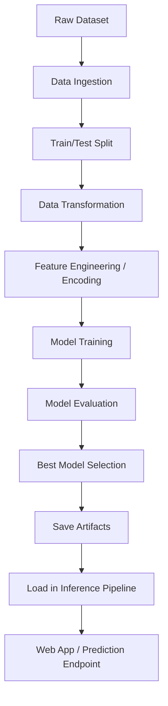
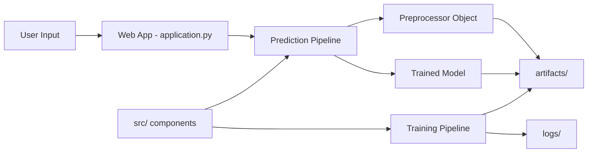

# End-to-End ML Project  
### Production-Style Machine Learning Pipeline with Training, Inference, and Web App Integration

[](https://www.python.org/)
[](#-end-to-end-workflow)
[](#)
[](#-deployment)

---

## 📌 Table of Contents

- [1. Project Overview](#1-project-overview)
- [2. Problem Statement](#2-problem-statement)
- [3. Business Use Cases](#3-business-use-cases)
- [4. Solution Approach](#4-solution-approach)
- [5. End-to-End Workflow](#5-end-to-end-workflow)
- [6. System Architecture](#6-system-architecture)
- [7. Repository Structure](#7-repository-structure)
- [8. Detailed Pipeline Explanation](#8-detailed-pipeline-explanation)
- [9. Local Setup and Installation](#9-local-setup-and-installation)
- [10. Running the Application](#10-running-the-application)
- [11. Model Artifacts and Reproducibility](#11-model-artifacts-and-reproducibility)
- [12. Logging and Monitoring](#12-logging-and-monitoring)
- [13. Deployment Strategy](#13-deployment-strategy)
- [14. API/UI Usage Guide](#14-apiui-usage-guide)
- [15. Testing Strategy (Recommended)](#15-testing-strategy-recommended)
- [16. Security, Reliability, and Best Practices](#16-security-reliability-and-best-practices)
- [17. Future Enhancements / Roadmap](#17-future-enhancements--roadmap)
- [18. Contribution Guide](#18-contribution-guide)
- [19. License](#19-license)
- [20. Author](#20-author)

---

## 1. Project Overview

This repository demonstrates a **complete machine learning lifecycle** implementation in a modular, scalable way.  
It is designed as an **industry-style template** where the ML workflow is separated into reusable components such as:

- Data ingestion
- Data transformation / preprocessing
- Model training and evaluation
- Artifact persistence
- Inference serving through an application layer

The project also includes deployment-oriented configuration files (`Procfile`, `.ebextensions/`) and folder conventions that align with practical MLOps patterns.

---

## 2. Problem Statement

Build a robust and maintainable ML system that:

1. Trains a model on structured data
2. Applies consistent preprocessing between train and inference
3. Saves artifacts safely for reuse
4. Exposes prediction functionality through an application
5. Supports local execution and deployment with minimal friction

---

## 3. Business Use Cases

This architecture can be adapted for many real-world ML systems such as:

- 🎓 Student performance prediction
- 🏦 Loan default/risk scoring
- 🛒 Customer propensity/churn prediction
- 🏥 Health risk scoring from tabular records
- 🏭 Predictive quality checks in manufacturing

### Why this structure is useful in business environments

- Clear separation of training and inference concerns
- Easy retraining and model replacement
- Better maintainability for teams
- Simpler deployment and rollback strategy

---

## 4. Solution Approach

The project follows a layered approach:

- **Code Layer (`src/`)**: core ML components and orchestration logic
- **Artifact Layer (`artifacts/`)**: serialized models and preprocessors
- **Application Layer (`application.py`, `templates/`)**: prediction interface/UI
- **Operational Layer (`logs/`, `Procfile`, `.ebextensions/`)**: execution + deployment readiness

---

## 5. End-to-End Workflow



### Workflow Summary

1. Data is read and prepared.
2. Training pipeline transforms and fits model(s).
3. Best model and preprocessors are stored in `artifacts/`.
4. Inference path loads artifacts and predicts from user input.
5. UI/application provides practical interaction layer.

---

## 6. System Architecture



### Architectural Principles Used

- **Modularity**: components are independently maintainable
- **Reusability**: same transforms reused during inference
- **Traceability**: logs and artifacts capture execution outcomes
- **Deployability**: run-time entrypoint + process definition included

---

## 7. Repository Structure

```bash
End-to-End-ML/
├── .ebextensions/               # Deployment/environment extensions
├── artifacts/                   # Serialized model + preprocessing artifacts
├── catboost_info/               # CatBoost-specific training logs/metadata
├── logs/                        # Execution and debug logs
├── notebook/                    # EDA, experiments, and prototyping
├── src/                         # Core source code for pipeline components
├── templates/                   # HTML templates for UI rendering
├── application.py               # Main app entrypoint
├── Procfile                     # Process declaration for deployment
├── requirements.txt             # Python dependencies
├── setup.py                     # Package setup/installation metadata
└── README.md                    # Project documentation
```

---

## 8. Detailed Pipeline Explanation

> The exact class/function names may vary by implementation inside `src/`, but this section reflects the intended architecture based on repo structure.

### 8.1 Data Ingestion

- Reads source dataset(s)
- Performs basic validation
- Splits into train/test
- Stores intermediate files if configured

### 8.2 Data Transformation

- Handles missing values
- Encodes categorical variables
- Scales/normalizes numerical features (as configured)
- Builds a transformation pipeline object

### 8.3 Model Training

- Trains one or multiple models
- Compares metrics
- Selects best candidate
- Persists selected model in `artifacts/`

### 8.4 Evaluation

- Measures model performance on holdout data
- Logs scores/insights for traceability
- Ensures model quality before inference usage

### 8.5 Inference Pipeline

- Loads serialized preprocessor + trained model
- Applies same transformation logic to incoming inputs
- Returns final prediction to UI/application response

---

## 9. Local Setup and Installation

### 9.1 Clone the repository

```bash
git clone https://github.com/ayushmittal62/End-to-End-ML.git
cd End-to-End-ML
```

### 9.2 Create and activate virtual environment

```bash
python -m venv .venv
```

#### Windows (PowerShell)

```bash
.\.venv\Scripts\Activate.ps1
```

#### macOS/Linux

```bash
source .venv/bin/activate
```

### 9.3 Install dependencies

```bash
pip install --upgrade pip
pip install -r requirements.txt
```

Optional package install:

```bash
pip install -e .
```

---

## 10. Running the Application

Start application locally:

```bash
python application.py
```

Open in browser:

```text
http://127.0.0.1:5000
```

> If host/port are defined differently in code, follow `application.py` configuration.

---

## 11. Model Artifacts and Reproducibility

Artifacts saved in `artifacts/` are central to reproducibility:

- Trained model object
- Preprocessing/transformation object
- Any supporting metadata required for prediction

### Reproducibility Guidelines

- Keep training data versioned (recommended)
- Track experiment parameters (recommended)
- Fix random seeds where needed
- Avoid manual editing of serialized artifacts

---

## 12. Logging and Monitoring

- Runtime and pipeline logs are stored in `logs/`
- Model training engine logs (e.g., CatBoost) in `catboost_info/`

### Recommended Logging Improvements

- Structured JSON logs
- Per-run unique IDs
- Log levels per environment (dev/stage/prod)
- External log sink integration (ELK/CloudWatch/Grafana Loki)

---

## 13. Deployment Strategy

This repository already includes:

- **`Procfile`**: process declaration for deployment platform startup
- **`.ebextensions/`**: environment/config support for deployment automation

### Typical deployment flow

1. Prepare environment variables
2. Install dependencies from `requirements.txt`
3. Launch app via process definition
4. Verify artifact availability in deployment environment

### Production deployment recommendations

- Add containerization (`Dockerfile`)
- Add health-check endpoint
- Externalize configuration via `.env` or secrets manager
- Use CI/CD for automated test + deploy

---

## 14. API/UI Usage Guide

The app layer (`application.py` + `templates/`) is intended to collect user input and return predictions.

### Typical interaction pattern

1. User opens app page
2. Fills form fields required by model
3. Submits input
4. Backend loads artifacts and predicts
5. Result is rendered back to UI

> Update this section with exact route names (`/predict`, `/home`, etc.) based on your current implementation for maximum precision.

---

## 15. Testing Strategy (Recommended)

To make this project enterprise-grade, add tests for:

### Unit Tests
- Data transformation functions
- Utility/helper modules
- Model loading/prediction functions

### Integration Tests
- Full train pipeline run
- Inference pipeline with realistic sample payload

### E2E Tests
- App endpoint response validation
- UI form submission to prediction rendering flow

Suggested tools: `pytest`, `pytest-cov`, `tox`.

---

## 16. Security, Reliability, and Best Practices

- Validate all incoming user input
- Avoid exposing stack traces in production UI
- Keep secrets out of source code
- Pin dependency versions
- Add graceful error handling for missing artifacts
- Use defensive loading for corrupted model files

---

## 17. Future Enhancements / Roadmap

- [ ] Add experiment tracking (MLflow/W&B)
- [ ] Add data and model versioning (DVC)
- [ ] Add Docker + docker-compose support
- [ ] Add CI pipeline (lint + tests + build)
- [ ] Add monitoring for model drift
- [ ] Add REST API docs (OpenAPI/Swagger)
- [ ] Add model card and fairness report
- [ ] Add performance benchmarking report

---

## 18. Contribution Guide

Contributions are welcome and appreciated.

### Steps

1. Fork this repository
2. Create a branch  
   `git checkout -b feature/your-feature-name`
3. Make your changes
4. Commit  
   `git commit -m "feat: add your feature"`
5. Push  
   `git push origin feature/your-feature-name`
6. Open a Pull Request

### Commit Message Convention (recommended)

- `feat:` new feature
- `fix:` bug fix
- `refactor:` code cleanup
- `docs:` documentation changes
- `test:` testing updates

---

## 19. License

No license file is currently present in this repository.  
If you plan to open-source for reuse, add a `LICENSE` file (e.g., MIT/Apache-2.0).

---

## 20. Author

**Ayush Mittal**  
GitHub: [@ayushmittal62](https://github.com/ayushmittal62)

---

## 🙌 Acknowledgements

This project reflects a strong practical implementation of a real-world end-to-end ML pipeline and serves as an excellent base for production-oriented ML system development.

If this project helped you, consider giving it a ⭐ on GitHub.
